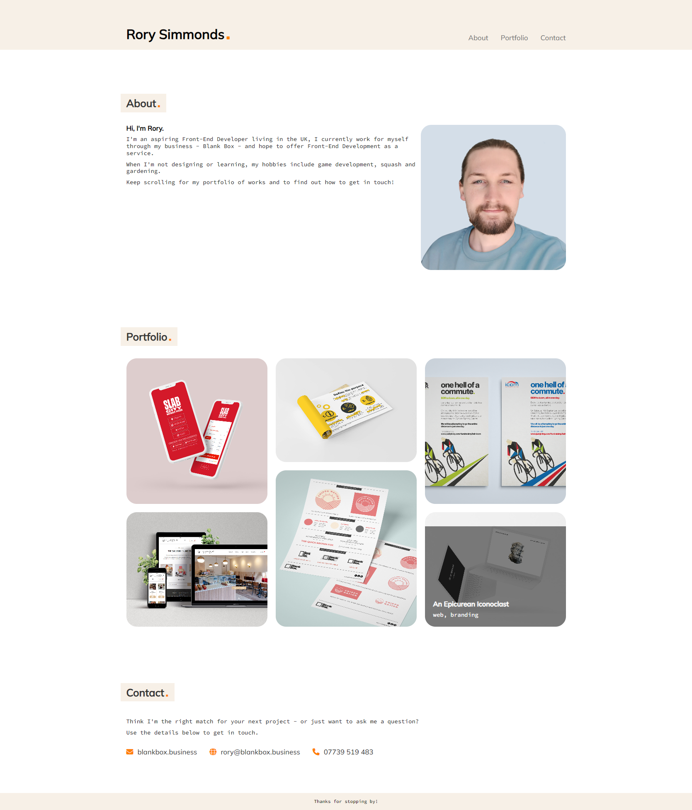

# Rory's Portfolio

A basic portfolio built using HTML and CSS.

## Description

This project is a simple portfolio showcasing my professional projects. The application was built using HTML and CSS.

Features include:
* Responsive navbar with navigation to content
* Responsive portfolio using grid display
* Google fonts and FontAwesome intergrations
* Semantic HTML elements

## Links

[Link to the deployed site](https://uberponky.github.io/Module-2-Challenge//)

[Link to the GitHub repository](https://github.com/uberponky/Module-2-Challenge)

## Installation

Access the deployed website via the links above. You can also clone the repository via Github and deploy locally to view the site.

## Usage

Once accessed / deployed, the website is optimised for usage on desktop, laptop, tablet and mobile screens.

## Credits

Fonts were sourced via [Google Fonts](https://fonts.google.com/).
Icons were sources via [Font Awesome](https://fontawesome.com/).

## Contributing

N/A

## License

MIT License

Copyright (c) 2023 Rory Simmonds

Permission is hereby granted, free of charge, to any person obtaining a copy
of this software and associated documentation files (the "Software"), to deal
in the Software without restriction, including without limitation the rights
to use, copy, modify, merge, publish, distribute, sublicense, and/or sell
copies of the Software, and to permit persons to whom the Software is
furnished to do so, subject to the following conditions:

The above copyright notice and this permission notice shall be included in all
copies or substantial portions of the Software.

THE SOFTWARE IS PROVIDED "AS IS", WITHOUT WARRANTY OF ANY KIND, EXPRESS OR
IMPLIED, INCLUDING BUT NOT LIMITED TO THE WARRANTIES OF MERCHANTABILITY,
FITNESS FOR A PARTICULAR PURPOSE AND NONINFRINGEMENT. IN NO EVENT SHALL THE
AUTHORS OR COPYRIGHT HOLDERS BE LIABLE FOR ANY CLAIM, DAMAGES OR OTHER
LIABILITY, WHETHER IN AN ACTION OF CONTRACT, TORT OR OTHERWISE, ARISING FROM,
OUT OF OR IN CONNECTION WITH THE SOFTWARE OR THE USE OR OTHER DEALINGS IN THE
SOFTWARE.
